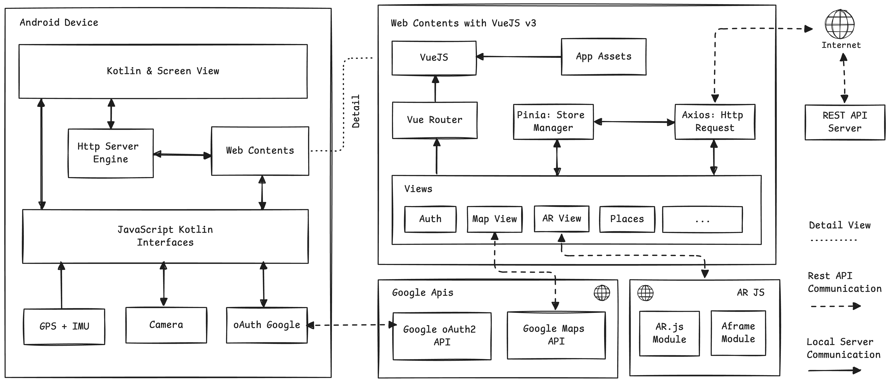

## About Project

Aplikasi android sebagai tampilan utama aplikasi yang dibuat dengan Kotlin + VueJS.

## Development Requirements
- Git
- NodeJS v20.x.x
- Android Studio

## Software Architecture
Dibuat menggunakan https://excalidraw.com/

<center>
    
</center>

## Development Installations

Instalasi development tools:
- Install program Git. Download https://git-scm.com/downloads
- Instal interpreter NodeJS versi v20.x.x. Download https://nodejs.org/en
- Instal IDE Android Studio. Download https://developer.android.com

Instalasi dependency:
```sh
npm i -g ts-node
npm install
```

Setup environment variable:
- Salin file `.env.example` menjadi file `.env`
- Isi setiap variable sesuai dengan kebutuhan:
- `VITE_APP_API_BASE_URL`: Host dimana backend api dijalankan.
- `VITE_APP_GOOGLE_AUTH_CLIENT_ID`: Key untuk menggunakan OAuth google. Panduan https://developers.google.com/identity/protocols/oauth2
- `VITE_APP_GOOGLE_MAPS_API_KEY=""`: Key google maps javascript api. Panduan https://developers.google.com/maps/documentation/javascript/overview


Menjalankan aplikasi di web browser:
```sh
npm run dev
```

Aplikasi secara default dapat dibuka pada http://localhost:5173

Untuk menjalankannya pada device android:
- Buka Android Studio.
- Install SDK dan emulator yang akan digunakan.
- Buka directory `/android` di Android Studio.
- Jalankan aplikasi.